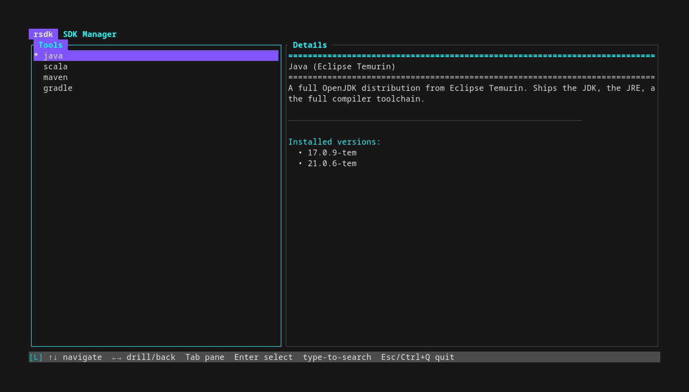

# `rsdk` - Universal JVM tools manager

`rsdk` makes it easy to install and juggle with multiple versions of JDK, Maven, Gradle, etc...

`rsdk` works on Windows, Linux, MacOS and natively integrates with bash, zsh, **powershell**, **fish**, **nushell**

`rsdk` is a self-contained binary executable, it works the same everywhere and does not require additional packages to be installed.

`rsdk` provides a convenient TUI in addition to the classic command-line interface:



## Installation

Linux / macOS
```bash
curl -fsSL https://github.com/fralalonde/rsdk/releases/latest/download/install.sh | sh
```

Windows
```powershell
irm https://github.com/fralalonde/rsdk/releases/latest/download/install.ps1 | iex
```

The install script detects shells and configures rsdk for each.

To update to the latest `rsdk` version, just run the installer script again.

## rsdk is _not_ SDKMAN!

**PLEASE - DO NOT BOTHER THE SDKMAN MAINTAINERS / COMMUNITY IF YOU'RE HAVING TROUBLE WITH RSDK.**

[SDKMAN](https://sdkman.io/) rocks! But I mainly use fish shell on Linux and Powershell on Windows,
neither of which are natively supported by SDKMAN (since it is written mostly in bash).
I wrote `rsdk` from scratch and made my own shell-agnostic SDKMAN replacement.
Although it is completely independent of SDKMAN _locally_, `rsdk` still relies on SDKMAN network repositories and indexes.

Both projects are _completely separate_ and rsdk's existence should not be a burden to sdkman in _any_ way. 
Instead, do not hesitate to open an [issue](https://github.com/fralalonde/rsdk/issues).

Take note that `rsdk` does not try to replicate all of SDKMAN:

- there's no offline mode
- some commands behave differently
- tools are installed in the `~/.rsdk/tools` folder (so you can have both `rsdk` and SDKMAN installed at the same time)

## Command Line

`rsdk` deals in `tools` and `versions`.

| Shell                        | Command Format                    | Examples                     |
|------------------------------|-----------------------------------|------------------------------|
| List available tools         | `rsdk list`                       |                              |
| List available tool versions | `rsdk list <tool>`                | `rsdk list java`             |
| Install default version      | `rsdk install <tool>`             | `rsdk install maven`         |
| Install specific version     | `rsdk install <tool> <version>`   | `rsdk install maven 3.9.9`   |
| Remove version               | `rsdk uninstall <tool> <version>` | `rsdk uninstall maven 3.9.9` |
| Set default version          | `rsdk default <tool> <version>`   | `rsdk default maven 3.9.9`   |
| Set active version           | `rsdk use <tool> <version>`       | `rsdk use maven 3.9.9`       |
| Flush downloads cache        | `rsdk flush`                      |                              |
| Save env to `.sdkmanrc`      | `rsdk env init`                   |                              |
| Apply `.sdkmanrc` env        | `rsdk env`                        |                              |
| Install `.sdkmanrc` tools    | `rsdk env install`                |                              |
| Revert env to defaults       | `rsdk env clear`                  |                              |
| Enter TUI                    | `rsdk tui`                        |                              |
| Show help                    | `rsdk --help`                     |                              |

Running `rsdk use <tool> <version>` for a version that isn't installed will
offer to install it first, then make it current.

Running with `--debug` enables verbose output and stack traces (equivalent of `RUST_BACKTRACE=1` and `RUST_LOG=debug`).  

## TUI

`rsdk tui` launches an interactive tool browser for
discovering, installing, and managing JVM tools without having to type commands.

**Layout:** two panes. Left lists tools (installed ones starred and ranked
first). Right shows the selected tool's description + installed versions,
or — after drilling in — the list of available versions.

**Navigation:**

| Key            | Action                                    |
|----------------|-------------------------------------------|
| `↑` `↓` / `k` `j` | move selection                         |
| `Enter` / `→`  | drill in (tool → versions / open actions) |
| `Esc` / `←`    | go back (Esc at top level quits)          |
| `Tab`          | switch active pane                        |
| `PgUp` / `PgDn`| jump by 10 rows                           |
| type any text  | filter the active pane                    |
| `Enter` on a version | pick an action: Install, Use, Set default, Remove |

## Network options

If proxying is required, ``rsdk`` honors the `http_proxy` and `https_proxy` environment variables (same as curl).

If required, ``--insecure`` disables certificate validation allowing use of self-signed certificates.

## Disclaimer
Although I tried hard to make `rsdk` reliable and safe, using it may still have unexpected consequences. 
By running it on your computer, _you are solely responsible for what may happen_.

For better or worse, most of `rsdk` was coded without the use of AI.
